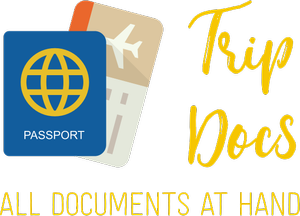

# Mejora_Projecte_Integrat_2DAM

# Trip Docs
## *All Documents at Hand*
### Mejora del proyecto Trip Docs desarrollado por un miembro de **Visoft** (Florida-Universitaria)

----

### 1.	Integrantes de equipo de desarrollo

| Membres        | Email           | Avatar  |
| ------------- |:-------------:| :-----:|
| Josep Iborra Pons     | josersillero@gmail.com |  |

### 2.	Descripción del proyecto

App destinada a viajeros, que dispone de una serie de funcionalidades que facilitan la gestión de la documentación requerida en los viajes.
Y se ha hecho una mejora donde se añaden mas idiomas y una estetica nueva a la aplicación para que se mas atractiva para el publico.

### 3.	Objetivo del proyecto

Hacer una mejora a la aplicacion ya creada de tripdocs.

 
### 4.	Justificación del proyecto

En la actualidad viajar a otros países, especialmente fuera de la unión europea, requiere de una gran cantidad de documentación que resulta difícil de gestionar y guardar, o conservar al preparar y realizar los viajes. Por lo que consideramos, que ***Trip Docs*** es una aplicación de gran interes para los viajeros, ya que facilita al usuario una serie de funcionalidades que facilitan la gestión ordendada de la documentación.

A continuación, detallamos un listado de la documentación que es posible tener que gestionar durante un viaje:

-	Documentación legal identificativa
    -	Pasaporte
    -	DNI o equivalente

-	Visados y permisos de entrada
    -	Visados
    -   Permisos de trabajo

-	Documentación sanitaria
    -	Pasaporte Internacional de Vacunación
    -	Pasaporte Covid
    -	Tarjeta Sanitaria Europea
    -	Justificantes exenciones por operaciones / tratamientos médicos (ej.: no arco detector metales por marcapasos, etc.).
    -	Justificantes medicación (recetas, informes médicos)
    -	Otras informaciones importantes.

-	Carnets utilización vehículos y actividades
    -	Permiso Internacional de Circulación
    -  	Permiso de Circulación

-	Seguros Privados
    -	Seguros de Viaje
    -	Seguros de Salud
    -	Seguros de Conducción (a terceros, etc.)

-	Billetes, reservas y entradas
    -	Medios de transporte
    -	Alojamiento
    -	Actividades

 
### 5.	Funcionalidades de la aplicación

Las principales funcionalidades implementadas en la aplicación son:
-	Acceso mediante usuario y contraseña encriptada.
- Organización de la información por:
    -   perfiles (campo de texto libre), y
    -   colecciones (identificativos, sanitarios, transportes, alojamientos, seguros, eventos, otros).
-	Registro de la documentación mediante:
    -   toma de una foto del documento con la app, e 
    -   introducción del nombre del documento, fecha de interes (caducidad, utilización, etc.), colección y perfil al que pertenece el documento.
-	Almacenamiento (persistencia) de la información registrada en una base de datos en Azure.
- Acceso a la información almacenada mediante un sistema constituido por tarjetas que muestra la información organizada por perfiles, permite filtrarla por colecciones y buscarla por el contenido del nombre del documento. 
-	Visualización de la imagen del documento al presionar sobre la terjeta seleccionada.
- Alertas por proximidad de la fecha de interes (caducidad, utilización, etc.) establecida al registrar el documento.
- Posibilidad de actualización de los documentos previamente registrados.
- Multiidioma (inglés, valenciano, castellano, frances, aleman).

 
### 6.	Medios técnicos utilizados: tecnologías, lenguajes y estrategias de programación

En el desarrollo de la aplicación está previsto emplear distintos tipos de lenguajes y tecnologías, destacando las siguientes:
-	Lenguajes de programación: java, javascript, jsx
-	Lenguajes de marcas: json
-	Entornos de desarrollo y editores de código: Eclipse, Visual Studio Code
-	Gestores de bases de datos no solo relacionales: MongoDB
-	Librerías: React Native, React Native Paper, React Native Vector Icons, React Navigation, React Native Image Zoom Viewer, React Native Date Picker, MD5, i18next, Expo Image Picker, Axios
-	Servicio de servidor en la nube: Azure

La estrategia de programación planteada para poder gestionar los documentos guardados en formato imagen, consiste en crear una capa de metadatos (json), asociado a las imágenes guardadas, que contenga una plantilla con los campos que caracterizan a cada tipo de documento. Y que todos los datos, tanto archivos json como las imágenes de los documentos estén encriptadas para garantizar la confidencialidad de la información.

